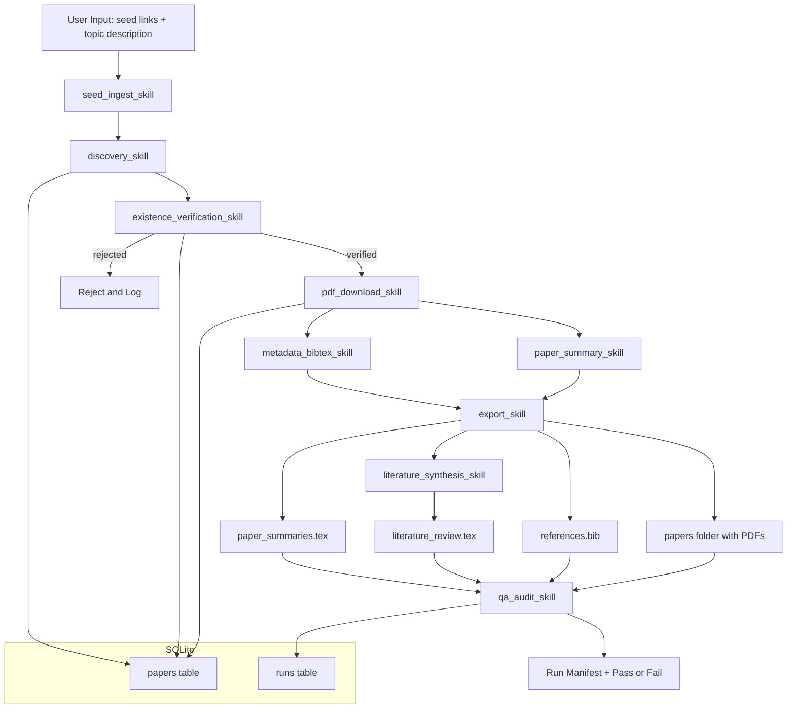

# Architecture

## Core Components
- Skills layer: modular task implementations with strict inputs/outputs.
- Orchestrator: stage sequencing, retries, state transitions, and logging.
- Storage: SQLite for run/paper lifecycle.
- Exporters: deterministic generation of PDF, BibTeX, and TeX artifacts.
- QA/Audit: cross-file consistency and citation integrity checks.
