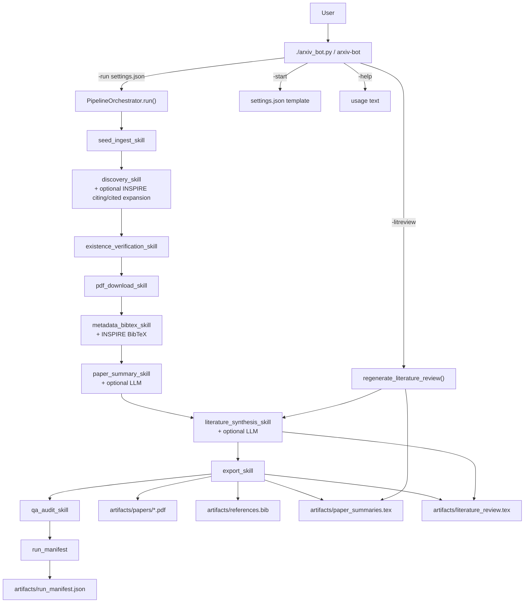

# Architecture

## Runtime Overview

## Main Components
- `CLI entry`: supports `-run`, `-litreview`, `-start`, and `-help`.
- `PipelineOrchestrator`: executes stage order, emits progress logs, and routes artifacts to configured output directory.
- `Skills`: pure-ish task modules for ingest, discovery, verification, download, metadata, summary, synthesis, export, QA, and manifest.
- `InspireClient`: INSPIRE API access for BibTeX, seed abstracts, and related-paper discovery.
- `LLMClient`: optional model-backed generation for per-paper summaries and synthesis with deterministic fallbacks.

## Data Contracts
- `PipelineInput`: seed links, project description, include/exclude keywords, related-paper relevance thresholds.
- `PaperRecord`: canonical per-paper state record through lifecycle:
  `discovered -> verified -> downloaded -> metadata_enriched -> summarized -> exported`.

## Output Guarantees
- Verified outputs are written under `<target_dir>/artifacts` by default.
- QA gate validates:
  - artifact existence and non-empty content
  - citation keys in TeX exist in `references.bib`
  - each exported paper is cited and has a local PDF
- Manifest captures stage history and per-paper provenance.
